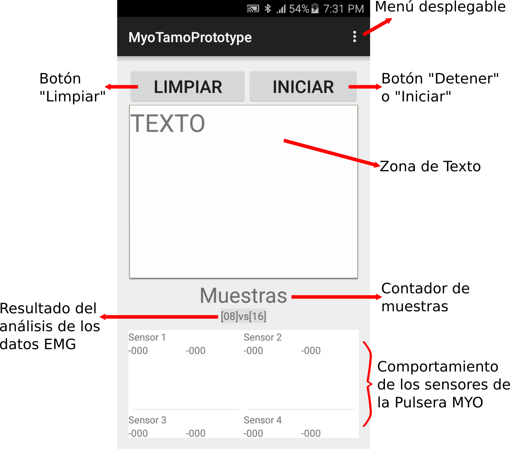
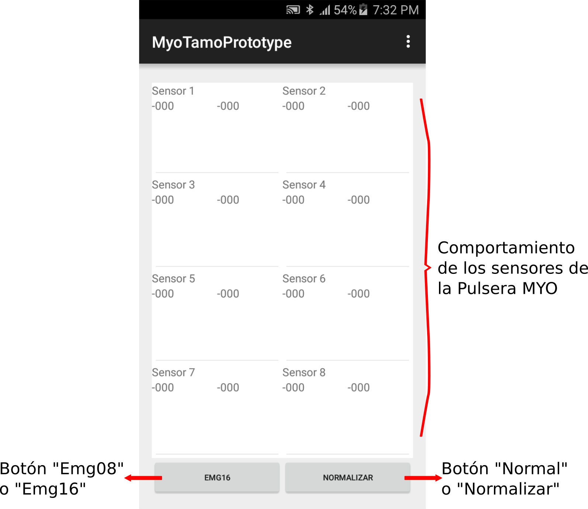

# Sistema de Lengua de Señas Mexicana con Pulsera MYO (MyoTAMO)
*******

El sistema presentado en este proyecto, nombrado <strong>“MyoTAMO”</strong> y cuyo código fuente se encuentra disponible en la carpeta <strong>“MyoTamoPrototype/”</strong>, permite conocer algunas de las señas del abecedario de la Lengua de Señas Mexicana (LSM), realizadas por una persona que vista una Pulsera MYO y este conectada a este sistema. Esta aplicación ha sido diseñada para dispositivos Android, es capaz de reconocer las señas correspondientes a las letras <strong>“A, B, C, D, E, G, H, I, L, M, N, O, P, R, S, T y U”</strong> del abecedario, formar palabras a través del deletreo de estas señas por parte de una persona que vista la Pulsera MYO y, además, presenta de un mecanismo sencillo para predecir que palabra se está deletreando.

 

## Proyecto

MyoTAMO es el producto de software del trabajo de investigación <strong>“Interpretación de la Lengua de Señas Utilizando una Interfaz Electromiográfica Móvil”</strong>, cuya documentación puede ser consultada a través de la carpeta <strong>“Tesis/”</strong>, organizada de la siguiente forma:

 
<ul>
  <li>
<strong>Tesis/Archivo1contenido1.pdf</strong> y <strong>Tesis/Archivo2contenido1:</strong> Documentos que representan al compendio sobre todo el proceso de investigación, análisis y desarrollo, llevado a cabo en este proyecto.
  
</li>
  <li>
<strong>Tesis/Archivo1contenido2.pdf</strong> y <strong>Tesis/Archivo2contenido2:</strong> Documentos que describen como hacer uso de la aplicación MyoTAMO, producto de este proyecto.
  
</li>
</ul>

Esta aplicación, como se expone en la siguiente imagen, captura los datos arrojados por los ocho sensores que componen a la Pulsera MYO a lo largo de un segundo y cálcula el valor promedio del conjunto de datos acumulados, generando un arreglo de ocho números de tipo <i>Double</i>. Aunque, un aspecto importante a destacar es que cada uno de los sensores de la Pulsera MYO, arroja dos valores diferentes de tipo <i>Entero</i>, frente a lo que, internamente MyoTAMO hace uso del Teorema de Fourier para convertir los dos valores arrojados en uno solo y normalizarlos (convertirlos a un valor entre cero y uno).

 

 

Por otra parte, para la detección las señas, MyoTAMO utiliza una Red Neuronal Artificial (RNA) generada a partir de los patrones de datos capturados de los ochos sensores de la Pulsera MYO, durante experimentos realizados con una persona a quien se le instruyo realizar las señas correspondientes a las letras <strong>“A, B, C, D, E, G, H, I, L, M, N, O, P, R, S, T y U”</strong> del abecedario. Estos patrones se generaron utilizando el código comentado en el método <strong>“translationHandGestureDetect”</strong> de la clase <strong>“GestureManager”</strong> del proyecto de Android localizado en la carpeta <strong>“MyoTamoPrototype/”</strong>. En relación a lo cual, cabe destacar que se usó MathLab como medio para la creación y el entrenamiento de las RNA, a través de los archivos <strong>“myoClasificadorRNA_Experimental_x08.m”</strong> y <strong>“myoClasificadorRNA_Experimental_x16.m”</strong>, disponibles en la carpeta <strong>“Red Neuronal/3_Patrones para RNA's/”</strong>. En la carpeta <strong>“Red Neuronal/3_Patrones para RNA's/PesosExperimentales/”</strong> se encuentran las RNA's resultantes de este proceso, y se ha dejado un ejemplo de los patrones utilizados en las carpetas <strong>“Red Neuronal/3_Patrones para RNA's/PatronesEMG_x08/”</strong> y <strong>“Red Neuronal/3_Patrones para RNA's/PatronesEMG_x16/”</strong>.

## Uso de MyoTAMO

MyoTAMO presenta una interfaz gráfica con un <strong>“Menú Desplegable en la esquina superior izquierda”</strong>, los botones <strong>“Limpiar”</strong> e <strong>“Iniciar”</strong> tambien en la parte superior, un <strong>“Espacio para la escritura de las señas interpretadas”</strong> debajo de los botones anteriores, un <strong>“Espacio para observar los datos electromiográficos censados en tiempo real”</strong> debajo del espacio para escribir y los botones <strong>“EMG16”</strong> y <strong>“Normalizar”</strong> localizados en la parte inferior de la interfaz. En donde, cada uno de estos elementos gráficos describe la siguiente funcionalidad:

 
<ul>
  <li>
<strong>Menú Desplegable:</strong> Elemento que muestra un conjunto de opciones para conectar y desconectar una Pulsera MYO, así como tambien, presenta una opción para revisar el estado de la conexión.
  
</li>
</ul>

 
<ul>
  <li>
<strong>Botón Limpiar:</strong> Elemento que remueve del <i>“Espacio para la escritura de las señas”</i> el texto o las letras descifradas por la aplicación, por los datos electromiográficos censados de la Pulsera MYO conectada a la aplicación.
  
</li>
  <li>
<strong>Botón Iniciar:</strong> De acuerdo con la leyenda de este elemento, su funcionalidad es la siguiente:
  <ul>
    <li>
<strong>Iniciar:</strong> Comienza con el proceso de lectura de los datos electromiográficos censados de la Pulsera MYO conectada a la aplicación, el proceso para descifrar las señas realizadas por el usuario que viste la Pulsera MYO, y luego de iniciar los procesos anteriores, cambia la leyenda del botón a <i>“Detener”</i>.
    
</li>
    <li>
<strong>Detener:</strong> Detiene el proceso de censado e interpretación de los datos electromiográficos, y cambia a leyenda del botón a <i>“Iniciar”</i>.
    
</li>
  </ul>
  
</li>
</ul>

 

 
<ul>
  <li>
<strong>Espacio para la visualización de los datos electromiográficos censados:</strong> Esta sección despliega una serie de elementos que permiten observar de forma gráfica, los datos electromiográficos censados en tiempo real de la Pulsera MYO conectada al sistema.
  
</li>
</ul>

 

 
<ul>
  <li>
<strong>Botón EMG16:</strong> De acuerdo con la leyenda de este elemento, su funcionalidad es la siguiente:
  <ul>
    <li>
<strong>EMG08:</strong> Permite visualizar en el <i>Espacio de visualización de los datos electromiográficos</i>, a los datos censados en su forma unificada, es decir, al flujo de datos arrojados por cada sensor de la Pulsera MYO. Posteriormente cambia la leyenda a <i>EMG16</i>.
    
</li>
    <li>
<strong>EMG16:</strong> Permite visualizar en el <i>Espacio de visualización de los datos electromiográficos</i>, el valor completo de los datos, es decir, los dos flujos de datos arrojados por cada sensor de la Pulsera MYO. Posteriormente cambia la leyenda a <i>EMG08</i>.
    
</li>
  </ul>
  
</li>
  <li>
<strong>Botón Normalizar:</strong> De acuerdo con la leyenda de este elemento, su funcionalidad es la siguiente:
  <ul>
    <li>
<strong>Normal:</strong> Permite observar en el <i>Espacio de visualización de los datos electromiográficos</i>, a los datos en bruto, es decir, como vengan desde los sensores, esten o no unificados. Posteriormente cambia la leyenda a <i>Normalizar</i>.
    
</li>
    <li>
<strong>Normalizar:</strong> Permite observar en el <i>Espacio de visualización de los datos electromiográficos</i>, a los datos en su forma normalizada, es decir, entre cero y uno. Posteriormente cambia la leyenda a <i>Normal</i>.
    
</li>
  </ul>
  
</li>
</ul>

 

Así, para mayor información se puede consultar el manual de usuario <strong>“Tesis/Archivo1contenido2.pdf”</strong> o <strong>“Tesis/Archivo2contenido2”</strong>.
  

## Requerimientos de uso

MyoTAMO es una aplicación desarrollada para dispositivos móviles con las siguientes características:

||Requerimientos recomendados| 
|------|-----|
|<strong>Sistema operativo</strong>|Android 4.4 (Kitkat) o superior|
|<strong>Memoria RAM</strong>|>= 512 MB|
|<strong>CPU</strong>|>= 1.0 GHz |
|<strong>Componente</strong>|Bluetooth|

*******
## Créditos

MyoTamo, se ha basado en: [MYO AndoridEMG](https://github.com/meleap/myo_AndoridEMG)

MyoTAMO fue desarrollado por < *Jorge Luis Jácome Domínguez* >.

######  Medios de contacto < [Linkedin](https://www.linkedin.com/in/jorge-luis-j%C3%A1come-dom%C3%ADnguez-44294a91/) - [Dibujando](https://dibujando.net/soragefroren) - [Facebook](https://www.facebook.com/SoraGefroren) - [Youtube](https://www.youtube.com/c/SoraGefroren) >
